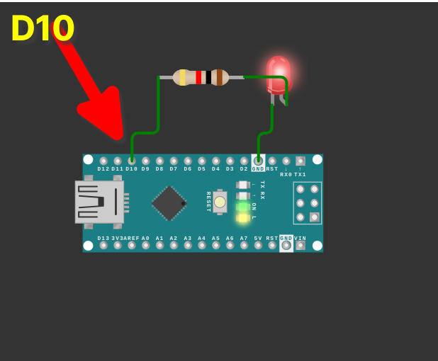

# grow-controllers
Microcontroller scripts for devices used for micro-scale farming.

## Scripts
- [aero_hydro_pump_saver_root_maximizer.c](aero_hydro_pump_saver_root_maximizer.c)

[Try it in a Wokwi Simulator](https://wokwi.com/projects/403891674345275393)

NOTE: This script is meant to run on arduino's and compatible. Pin 10 (by default) should be connected to a relay controlling a water or air pump. 
